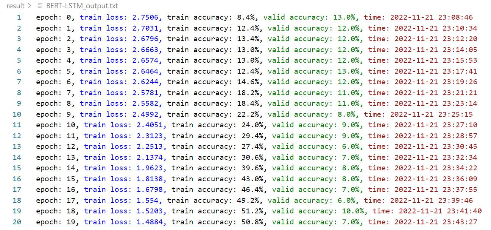

# Text-Classification-NLP
  Classifying text using Bi-LSTM, Transformer, BERT-ATT, BERT-BILSTM and BERT-CNN

 

## Abstract

Text classification is a machine learning technique that assigns a set of predefined categories to open text. Text classifiers can be used to organize and classify almost any type of text, such as documents, medical research documents, and articles across the web. Text classification is one of the fundamental tasks in natural language processing and has wide applications such as sentiment analysis, hashtag tagging, spam detection, and intent detection. This project mainly describes the text classification based on topic tags, using three encoders to train the weight parameters, namely Bi-LSTM, Transformer and pre-training BERT, and makes a comparison between the results and performance of these three encoders. 

 

## Background

Text is one of the most common types of unstructured data. Due to its messy nature, analyzing, understanding, organizing, and curating text data is difficult and time-consuming. Many institutions underutilize this information. Therefore, the use of machine learning for text Categorized techniques. With a text classifier, various relevant texts from emails, legal documents, social media, chatbots, surveys, etc. can be automatically constructed in a fast and efficient manner, enabling many social institutions to save text analysis data and automate business processes and time to make data-driven business decisions.

 

## Problem Description

Text classification algorithms are at the core of various software systems that process text data on a large scale. Email software uses text classification to determine whether a message is sent to an inbox or filtered into a spam folder, and forums use text classification to determine whether a comment should be flagged as inappropriate. The above example belongs to topic classification in text classification, which classifies text documents into one of a set of predefined topics. In many topic classification problems, this classification is mainly based on keywords in the text.

Text topic classification belongs to topic analysis in natural language. Topic analysis is a machine learning technique that organizes and makes sense of large amounts of textual data by assigning "labels" or categories to each text based on its theme, themes. Topic analysis uses natural language processing to break down human language, find patterns in text and unlock semantic structure to extract insights and make data-driven decisions. Text topic classification belongs to supervised learning in machine learning. It needs to understand the topic of the text before starting the analysis, and use labeled data to train the topic classifier, which is more accurate than clustering techniques.

 

## Solutions

Text topic classification is mainly divided into the following steps: 

1. Prerequisites and environment settings; 
2. Dataset import; 
3. Feature extraction based on text files; 
4. Execution of machine learning algorithms; 
5. Performance analysis and parameter adjustment. 

In the experiment, three different encoders are used to train the large model of machine learning to train the data set, and the data set is trained by supplementing and modifying the provided Bi-LSTM and Transformer framework. Then you need to add the pre-training Transformer module to the code to train the data, and compare the performance and results of these three different encoders.

 

## Algorithm flowchart of Bi-LSTM

 

## Algorithm flowchart of Transformer

 

## Pretrained Transformer - BERT

In terms of structure, BERT adopts the multi-layer bidirectional Transformer model architecture proposed by Google in 2017, mainly including Multi-Head Attention, Self Attention, Positional Encoding and model input. BERT is a sentence-level pre-trained language model that can directly obtain a unique vector representation of the entire sentence. Transformer can encode the global information, connect the sentence representation with the Softmax output layer, and the weight parameters during the training process are calculated and updated by gradient backpropagation. BERT uses the Transform structure to deepen the number of layers and improve learning efficiency.

BERT pre-training is a multi-task process involving two different pre-training tasks, Masked Language Model (MLM) and Next Sentence Prediction (NSP). To train bidirectional features, MLM takes a sentence as input to BERT model and optimizes the weights inside BERT model to output the same sentence on the other side, however a certain ratio of word tokens needs to be masked before inputting the sentence into BERT model. In fact, it is equivalent to inputting an incomplete sentence to the BERT model and asking the model to fill in the gap in the sentence. BERT will give the answer with the highest probability given the language pattern and the context of the word.

The model introduces NSP to predict whether the text at both ends of the input BERT is continuous text, that is, the probability of 0.5 is continuous text. The second segment input to the model during training will be randomly selected from the entire text with a probability of 0.5, and the text following the first segment will be selected with the remaining 0.5 probability. The above judgment of whether the next sentence is a continuous text (positive or negative case) is a binary classification operation, that is, to judge whether the current sentence is noise.

<h4 align="center">Fig. 1: Flowchart of BERT-based text classification algorithm<h4>

 

## Model we used

| **BERT-based Model** | **Architecture**                                             |
| :--------: | :------------------------------------------------------------: |
| **BERT-ATT** | **** |
| **BERT-BILSTM** |  |
| **BERT-CNN** |  |

**BERT-ATT**: BERT-ATT is a BERT model based on a small self-attention mechanism. After the first layer of BERT, the algorithm shown in Table 1 is implemented, and a fully connected layer is implemented before the output.

**BERT-BILSTM**: BERT-BILSTM is a combined model of BERT and Bi-LSTM. BERT-BiLSTM is not a simple weight combination model between BERT and Bi-LSTM, but uses BERT as its upstream part and Bi-LSTM as its downstream part. According to the introduction in the previous section, BERT has the ability to learn the statistical characteristics of adjacent words, while Bi-LSTM has the ability to learn contextual information. This is in line with the logic of the human language system, that is, basic grammar depends on statistical features, and specific meaning depends on context, so BERT-BiLSTM has great potential in classifying text labels.

**BERT-CNN**: The BERT-CNN model is formed from the combination of a bidirectional encoder representation from Transformer (BERT) and a convolutional neural network (CNN) for text classification. The model uses BERT to train the word semantic representation language model, and then dynamically generates semantic vectors according to the word context, and inputs them into CNN to predict the output.

 

## Experiment Environment

Environment: Visual Studio Code 1.73.1 + Python 3.6.8

Dataset: ChineseGLUE(CLUE)，https://github.com/CLUEbenchmark/CLUE

 

## Result

|          Transformer          |                            Result                            |
| :---------------------------: | :----------------------------------------------------------: |
| Transformer (Attention-based) |  |
|      General Transformer      |  |

It can be observed from table above that under the given conditions (the epoch is limited to 20 for comparison, the training set and the verification set are the same), the training set accuracy and test set accuracy of the Transformer based on the Attention mechanism are higher than the ordinary Transformer. The multi-head attention mechanism uses multiple heads to extract different channels in the high-dimensional vector space of the text. Each channel can learn different features. One head is equivalent to extracting a feature, improving the model learning effect.

 

|     Model     |                            Result                            |
| :-----------: | :----------------------------------------------------------: |
| Bi-LSTM Model |  |

From the training results of the Bi-LSTM model in table above, the Bi-LSTM is still effective in the task of text label classification. Although it is not as efficient as the Transformer with the Attention mechanism, it can still achieve a high level within epoch 100. The accuracy of the training set is 88.44%, and the accuracy of the validation set is slightly lower than the Transformer. This is due to the fact that the Attention layer set in the Bi-LSTM in the code is relatively simple, while the above-mentioned Transformer uses Multi-Head Attention, which is more efficient than the ordinary self-attention mechanism.

 

| BERT-based Model |                            Result                            |
| :--------------: | :----------------------------------------------------------: |
|     BERT-ATT     |  |
|    BERT-LSTM     |  |
|     BERT-CNN     |  |

It can be seen from table above that the BERT-LSTM and BERT-CNN models are facing the problem of overfitting, and the accuracy of the training set is high while the accuracy of the test set is low. Due to the time factor, the problem has not been corrected. On the one hand, it is too time-consuming to use the CPU to run the machine learning code, so a server connected to the GPU will be installed later. For BERT-ATT, the accuracy rate of the training set is as high as 98.92% at epoch 30, and the accuracy rate of the verification set is relatively stable, and the data is better than BERT-LSTM and BERT-CNN. Compared with these six models, the best model effect is the Transformer based on Multi-Head Attention and BERT-ATT .

 

## Conclusion

This project emphasized the usage of the three encoders Transformer, Bi-LSTM and BERT to classify Chinese text. Under the model with the Attention mechanism, the natural language processing tasks are more efficient, and the accuracy and model performance have also been improved. In particular, the multiple heads in the Multi-Head Attention mechanism enable the features in the network to have multiple different representations, which is conducive to the understanding of the context, thus greatly improving the performance of the model.

 

#### *References:*

[1] 王楠, 赵宏宇, 蔡月. 自然语言理解与行业知识图谱[M]. *械工业出版社*, ISBN: 978-7-111-69830-2. 

[2] Zhiyong Cui, Ruimin Ke, Ziyuan Pu, Yinhai Wang. Stacked Bidirectional and Unidirectional LSTM Recurrent Neural Network for Network-wide Traffic Speed Prediction[J]. *https://arxiv.org/ftp/arxiv/papers/1801/1801.02143.pdf*. 

[3] Vaswani, Ashish and Shazeer, Noam and Parmar, Niki and Uszkoreit, Jakob and Jones, Llion and Gomez, Aidan N. and Kaiser, Lukasz and Polosukhin, Illia. Attention Is All You Need[J]. *https://arxiv.org/abs/1706.03762,* 2017. 

[4] Songyinxin. Bert-TextClassification[DB/OL]. *https://github.com/songyingxin/Bert-TextClassification*, 2019. 

[5] R. Abas, A., Elhenawy, I., Zidan, M., Othman, M., 2022. BERT-CNN: A Deep Learning Model for Detecting Emotions from Text[J]. Computers, Materials & Continua 71, 2943–2961.. doi:10.32604/cmc.2022.021671.
